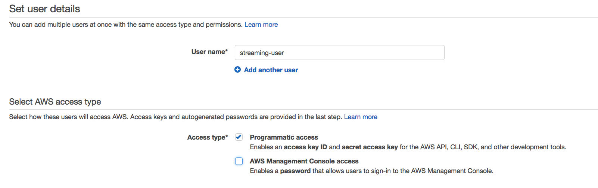
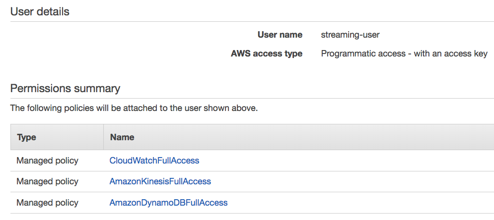

# kinesis-streaming-intro
Code examples for the article "Introduction to Stream Processing."

# Prerequisites

Before you run the project, you need to make sure that you have proper credentials to access Kinesis, DynamoDB, and CloudWatch (used by KCL). To do this log into AWS console, go to IAM service, and create a new user with programmatic access:




Make sure that you've added the following access policies to this user:



Save generated `access_key` and `secret_key` to `~/.aws/credentials`.

You can read more about it [here](https://docs.aws.amazon.com/cli/latest/userguide/cli-config-files.html).

# Building project

To build the project and download all dependencies run the following command:

```
./gradlew build
```

or if you use Windows:

```
./gradlew.bat build
```

# Running examples

This project is a set of classes `main` with methods. It includes:

* `CreateStream` - creates a Kinesis stream that is used by all other examples. Should be executed first.
* `KinesisProducer` - a producer that writes metrics data to Kinesis
* `GetListOfShards` - displays information about shards in the created stream
* `SingleShardConsumer` - a consumer that only reads data from a *single* shard using the low-level Kinesis API
* `KCLConsumer` - a consumer implemented using Kinesis Client Library
* `DeleteAllResources` - deletes all resources created by examples in this project

# Removing resources

This project can create AWS resources that will cost some money if not removed. After you've run any of the examples in this project run the `DeleteAllResources` it will remove both the Kinesis stream that is used in this project, as well as the DynamoDB table created by KCL.
